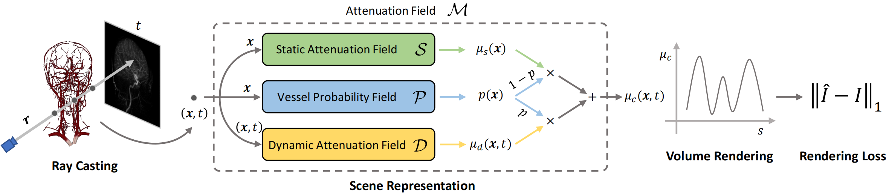
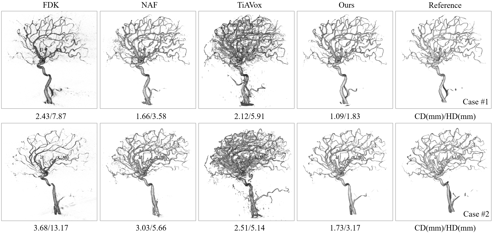

# Vessel Probability Guided Attenuation Learning
This is the official repo of our paper "3D Vessel Reconstruction from Sparse-View Dynamic DSA Images via Vessel Probability Guided Attenuation Learning". We will release our code and some test cases once our paper is accepted. For more details, please refer to our [paper](https://arxiv.org/abs/2405.10705).

# Introduction
## What is DSA?

https://github.com/Zhentao-Liu/VPAL/assets/81148025/78cf2bfc-a211-4a82-927f-4b5d7b2417c4

DSA (Digital Subtraction Angiography) is one of the gold standards in vascular disease diagnosing. The patient undergoes two rotational X-ray scans at identical positions. The first scan is performed before the injection of contrast agent (mask run), and the second scan is conducted after injection (fill run). Following this, the DSA sequence is generated by subtracting the X-ray images acquired during the fill run from those taken during the mask run. This process highlights the blood flow information marked by the contrast agent while removing other irrelevant tissues. Each DSA image captures a particular blood flow state as the contrast agent gradually fills the vessels. Time-resolved 2D DSA sequence delivers comprehensive insights into blood flow information and vessel anatomy, aiding in the diagnosis of vascular occlusions, abnormalities, and aneurysms. You may refer to the following video (case #1) for intuitive observation. From left to right, the images are: mask run, fill run, and DSA sequence. Note that, in our study, each DSA sequence contains 133 frames.

## Our Method

To achieve a holistic understanding of vessel anatomy, the DSA sequence is then utilized to reconstruct 3D vascular structures. However, DSA reconstruction presents a significant challenge due to the dynamic imaging nature, showcasing varying blood flow states at different timestamps. In this study, we propose to use a time-agnostic vessel probability field to solve this problem effectively. Our approach, termed as vessel probability guided
attenuation learning, represents the DSA imaging as a complementary weighted combination of static and dynamic attenuation fields, with the weights derived from the vessel probability field. Functioning as a dynamic mask, vessel probability provides proper gradients for both static and dynamic fields adaptive to different scene types. This mechanism facilitates a self-supervised decomposition between static backgrounds and dynamic contrast
agent flow, and significantly improves the reconstruction quality. Our model is trained by minimizing the disparity between synthesized projections and real captured DSA images. We further employ two training strategies to improve our reconstruction quality: (1) coarse-to-fine progressive training to achieve better geometry and (2) temporal perturbed rendering loss to enforce temporal consistency.

# Interesting Results
## Self-Supervised Static-Dynamic Decomposition

## High-Quality Vessel Reconstructions

Vessel reconstruction results from 40 training views. Our method significantly outperforms all the other methods, which looks quite close to the reference one provided by DSA scanner with full 133 views. We produce reconstructions with less noise, more complete vascular topology, and smoother surfaces. For more visualizations, please refer to our paper.

## High-Quality Renderings

## Ablations

# Releasing
We will release our code and some test cases once our paper is accepted. I will continue updating this repo. To be continue. If you have any question, just reach out to me: liuzht2022@shanghaitech.edu.cn

# Citation
Please cite our paper if you think it is interesting.

      @ARTICLE{VPAL,
      title={3D Vessel Reconstruction from Sparse-View Dynamic DSA Images via Vessel Probability Guided Attenuation Learning}, 
      author={Zhentao Liu and Huangxuan Zhao and Wenhui Qin and Zhenghong Zhou and Xinggang Wang and Wenping Wang and Xiaochun Lai and Chuansheng Zheng and Dinggang Shen and Zhiming Cui},
      year={2024},
      eprint={2405.10705},
      archivePrefix={arXiv},
      primaryClass={eess.IV}
      }
