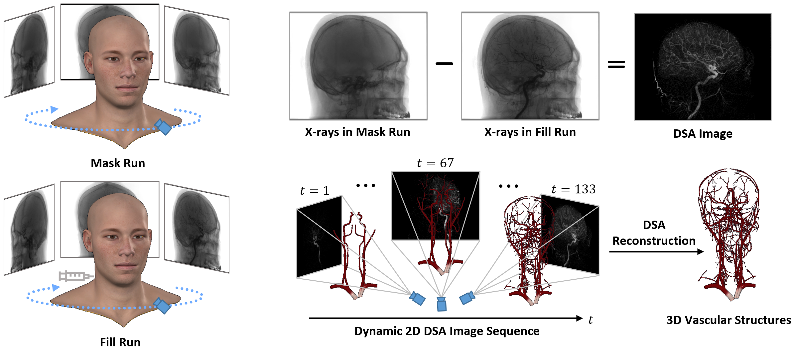
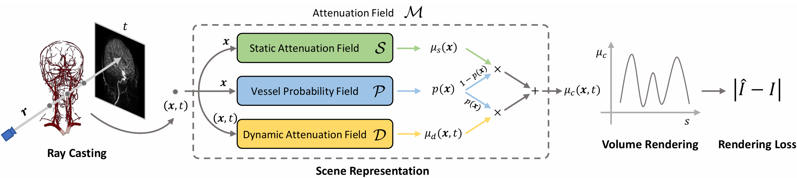

# VPAL: Vessel Probability Guided Attenuation Learning
[Zhentao Liu](https://zhentao-liu.github.io/), Huangxuan Zhao, [Wenhui Qin](https://psi.bme.shanghaitech.edu.cn/), Zhenghong Zhou, [Xinggang Wang](https://xwcv.github.io/index.htm), [Wenping Wang](https://www.cs.hku.hk/people/academic-staff/wenping#:~:text=Professor%20Wenping%20Wang.%20Alberta.%20Dr,%20Wang%20is%20Professor%20of%20Computer), [Xiaochun Lai](https://psi.bme.shanghaitech.edu.cn/), Chuangsheng Zheng, [Dinggang Shen](https://idea.bme.shanghaitech.edu.cn/), and [Zhiming Cui](https://shanghaitech-impact.github.io/)


## [Paper](https://www.sciencedirect.com/science/article/pii/S136184152600157X?via=ihub)

This is the official repo of our **MedIA 2026** paper "3D Vessel Reconstruction from Sparse-View Dynamic DSA Images via Vessel Probability Guided Attenuation Learning", a NeRF-based framework for DSA vessel reconstruction.




# Introduction

https://github.com/Zhentao-Liu/VPAL/assets/81148025/78cf2bfc-a211-4a82-927f-4b5d7b2417c4

DSA (Digital Subtraction Angiography) is one of the gold standards in vascular disease diagnosing. The patient undergoes two rotational X-ray scans at identical positions. The first scan is performed before the injection of contrast agent (mask run), and the second scan is conducted after injection (fill run). Following this, the DSA sequence is generated by subtracting the X-ray images acquired during the fill run from those taken during the mask run. This process highlights the blood flow information marked by the contrast agent while removing other irrelevant tissues. Each DSA image captures a particular blood flow state as the contrast agent gradually fills the vessels. Time-resolved 2D DSA sequence delivers comprehensive insights into blood flow information and vessel anatomy, aiding in the diagnosis of vascular occlusions, abnormalities, and aneurysms. You may refer to the above video (case #1) for intuitive observation. Note that, in our study, each DSA sequence contains 133 frames.

To achieve a holistic understanding of vessel anatomy, the DSA sequence is then utilized to reconstruct 3D vascular structures. Traditional algorithm (FDK) requires hundreds of scanning views (133) to perform reconstruction, results in significant radiation exposure. Moreover, the dynamic imaging nature of DSA scanning also presents a significant challenge. We aim to (1) effectively model the dynamic nature of DSA imaging, and (2) reduce the number of required scanning views to decrease radiation dosage.

# Method


In this study, we propose to use a time-agnostic vessel probability field to solve this problem effectively. Our approach, termed as vessel probability guided attenuation learning, represents the DSA imaging as a complementary weighted combination of static and dynamic attenuation fields, with the weights derived from the vessel probability field. Functioning as a dynamic mask, vessel probability provides proper gradients for both static and dynamic fields adaptive to different scene types. This mechanism facilitates a self-supervised decomposition between static backgrounds and dynamic contrast agent flow, and significantly improves the reconstruction quality. Our model is trained by minimizing the discrepency between synthesized projections and real captured DSA images. We further employ two training strategies to improve our reconstruction quality: (1) coarse-to-fine progressive training to achieve better geometry and (2) temporal perturbed rendering loss to enforce temporal consistency.

# Setup
First clone this repo. Then set up an environment and install packages.

```bash
git clone https://github.com/ShanghaiTech-IMPACT/VPAL.git
cd VPAL
conda create -n VPAL python=3.8
conda activate VPAL
pip install torch==1.13.0+cu117 torchvision==0.14.0+cu117 --extra-index-url https://download.pytorch.org/whl/cu117
pip install -r requirements.txt
git clone --recursive https://github.com/nvlabs/tiny-cuda-nn
cd tiny-cuda-nn/bindings/torch
python setup.py install
cd ../../..
pip install nerfacc -f https://nerfacc-bucket.s3.us-west-2.amazonaws.com/whl/torch-1.13.0_cu117.html
```

> **Note:** After installing nerfacc, please comment out the following lines in `nerfacc/estimators/occ_grid.py`:
> ```python
> # # voxel coordinates [0, 1]^3 -> world
> # x = self.aabbs[lvl, :3] + x * (
> #     self.aabbs[lvl, 3:] - self.aabbs[lvl, :3]
> # )
> ```

# Dataset
We use two datasets in our experiments. Example data (case #1 in our paper) is provided by [this link](https://drive.google.com/drive/folders/1faTv0EU0Y93vWnfv5s2cBTG4GCxIeds0?usp=sharing).

# Usage
After downloading the data, you could run the following command to train your model.

```bash
python train.py -n=case1_30v -c=./conf/VPAL.conf -D=./dataset/case1 --is_train --disable_fixview --disable_fixtime --nviews=30
```

You can use nerfacc toolbox to accelerate the training process with 3x acceleration.

```bash
python train.py -n=case1_30v -c=./conf/VPAL.conf -D=./dataset/case1 --is_train --disable_fixview --disable_fixtime --nviews=30 --occacc
```

# TBC
We will continue updating this repo. There maybe some errors during code cleaning. If you have any question, just reach out to the author: liuzht2022@shanghaitech.edu.cn

# Related-Link
We also develop 3DGS-based framework [4DRGS](https://github.com/ShanghaiTech-IMPACT/4DRGS) for DSA vessel reconstruction.


# Citation
If you think our work and repo are interesting, you may cite our paper.

    @article{VPAL,
      title={3D Vessel Reconstruction from Sparse-View Dynamic DSA Images via Vessel Probability Guided Attenuation Learning},
      author={Liu, Zhentao and Zhao, Huangxuan and Qin, Wenhui and Zhou, Zhenghong and Wang, Xinggang and Wang, Wenping and Lai, Xiaochun and Zheng, Chuansheng and Shen, Dinggang and Cui, Zhiming},
      journal={arXiv preprint arXiv:2405.10705},
      year={2024}
    }
